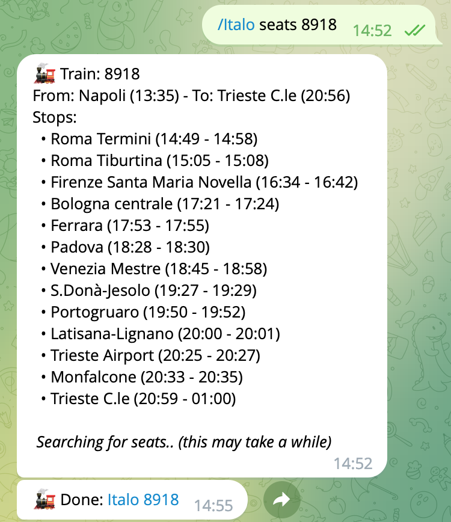

# Italo
_Curious about other seats of your train?_  
This program allows you to search for the availability of all the seats of your Italo train, 
showing stop by stop if the seat is busy or free.

```bash
$ python3 italo.py 8918
```


---

There is also a module for [RaspOne](https://www.github.com/lorenzodifuccia/RaspOne):


